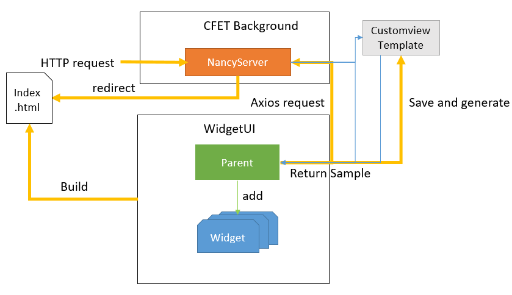
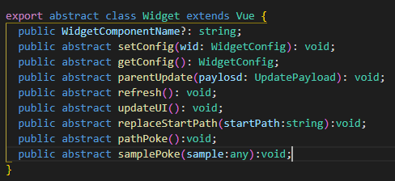
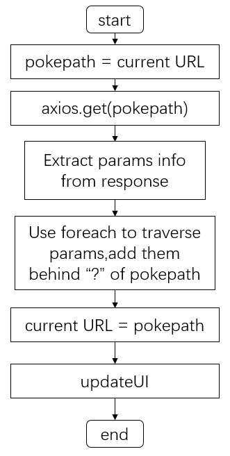
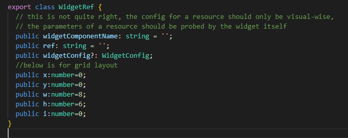
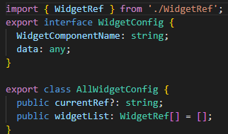
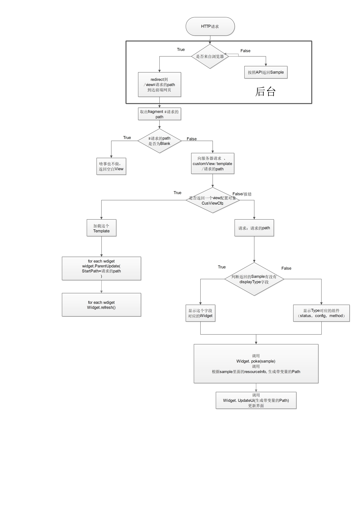
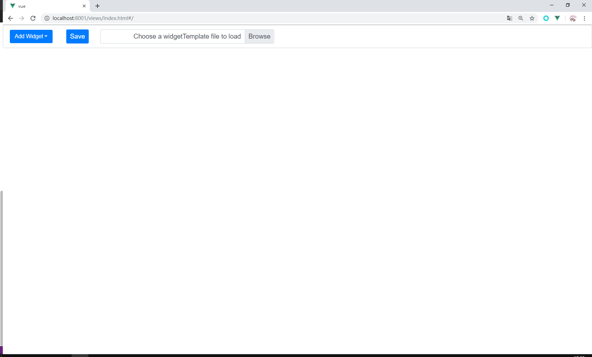
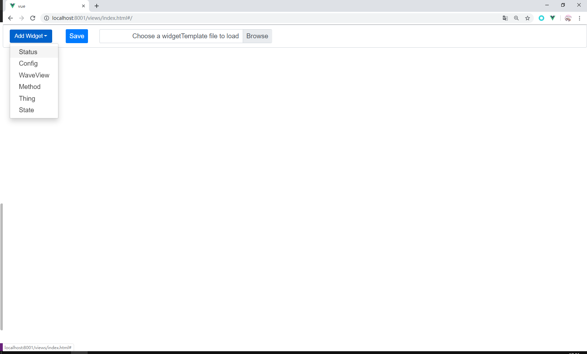
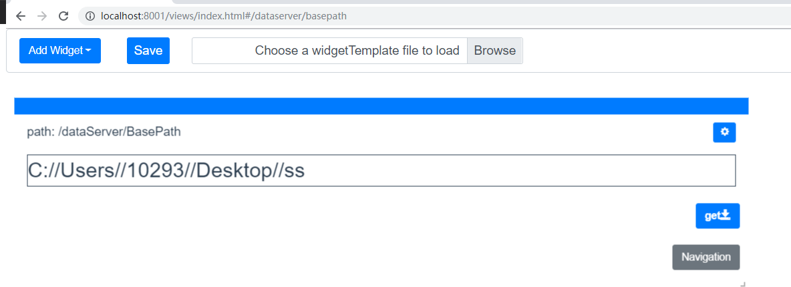

# WidgetUI设计文档
WidgetUI是为CFET控制框架设计的网页界面显示。

## Widget
widget是WidgetUI的显示控件，是CFET中的resource在网页界面的一种显示形式。每个WidgetUI界面是数个Widget加导航栏的组成。
### Widget Base
每个Widge都有共同的性质，这些性质被描述在Widget基类中，被每个Widget继承。
这些性质具体如下：

1. 每个Widget的类型名称(WidgetComponentName)
> 目前的类型按功能逻辑分类主要有Status，Method，Config，Thing，WaveView。按照显示样式的不同有State。之后根据需求还会陆续添加。
2. 保存和加载自身配置(getConfig，setConfig)
> getConfig：每个widget需要将自身的内容以给定的格式保存起来提供给Parent。
setConfig：根据Parent提供的数据填充自己的路径和输入框中的值，同时更新界面。
给定格式：

3. 刷新自身界面(updateUI)
> 根据当前的URL生成对应输入框等显示。
4. 刷新自身值(refresh)
> refresh:根据当前URL和输入框变量值向后台通过axios发出请求，根据返回值刷新显示值。
5. 根据给定路径自动填充返回完整路径(samplePoke，pathPoke)

> samplePoke是根据sample中的参数信息将变量补充在URL后生成一个完整的URL。
路径的来源有两种。
  一个是Parent向widget提供sample，调用每个widget的samplePoke。
  二对应pathPoke，是根据用户在输入框中输入的URL去向后台请求sample，然后自身调用自己的samplepoke从而对URL进行填充。

除了基类里的一些共有性质，每个widget也有共有的2个组件。

1. 变量输入框组(WidgetParams)
> 每个widget都需要一个输入框组提供给用户用来接收变量值，从而填补完全路径来和后台交互数据。
WidgetParams主要有4个方法：
setVariableList: 父组件将URL中后缀的参数信息传进来，WidgetParams根据参数信息生成对应的输入框。
setVariableInput: 这个方法用于加载保存配置时，setconfig时获取WidgetConfig中的参数信息来填写对应参数的输入框的值。
getVariableValues: 获取参数输入框中的值，返回一个以变量名为key，值为value的map
update: 刷新当前输入框显示

2. 父子路径导航(Navigation)
> 显示当前widget的父子属性的路径，便于进行跳转。
具体实现是通过获取父组件的URL信息，直接axios请求sample，取出其中的parentPath和childrenPath信息来显示。

## Parent
Parent是对所有widget进行管理的部分，是所有widget的父组件。
主要功能分为两部分，一是对Widget的管理，二是支持根据当前URL生成对应widget或者customview。

### 对Widget的管理
1. 添加并显示各widget(addWidget)
> 将选中widget添加进一个WidgetRef List，名字叫widgetList，同时为它分配一个唯一的ref。后期对Widget Component的调用都将通过ref。
在template中用v-for遍历widgetList，将其中所有存下的widget显示出来。
WidgetRef的结构如下：

2. 对widget进行拖拽放缩
> 这个功能引用了vue-grid-layout，将每个widget包含在一个GridItem里，便可对每个widget进行拖拽放缩

3. 保存以及加载configfile(saveWidgetList,loadTextFromFile)
> saveWidgetList: 调用widgetList中各widget的getconfig。并将它们对应的ref也保存下来以及拖拽功能所需要的坐标信息存下来。将所有widget的信息存在widgetConfigList中，具体结构如下：

然后把widgetConfigList保存为json文件。
loadTextFromFile: 从文件中导出widgetConfigList，调用widgetConfigList中widgetList的各widget的setconfig方法，将信息传给每个widget让它们自行处理。

### 根据fragment生成对应界面
具体流程图：

这个处理过程发生在vue的生命周期函数mounted中。

# WidgetUI使用说明
1. 初始界面

2. 添加Widget
> 点击Add Widget添加Widget

3. Widget使用，以Config为例
> 按住蓝边可以进行拖动，按住右下角直角符号可以进行放缩

> 点击右上角设置按钮出现Path输入框

> 输入路径，想要显示的参数名用$$括起来

> 点击OK生成对应输入框，同时路径输入框会被隐藏，想要显示再次点击右上设置按钮即可。

> 当不确定参数信息时，输入路径后点击Poke

> 会将该属性所需要的所有参数显示出来

> 想要获取或设置值时，在输入框中输入参数值，点击下箭头按钮

> Navigation会显示其父子属性链接，点击后即可跳转

4. 设好各信息后，点击save按钮将当前界面保存下来。
5. 加载保存界面时，点击Browse按钮选择文件加载。
6. 在浏览器栏直接输入属性路径也可以访问对应界面。
